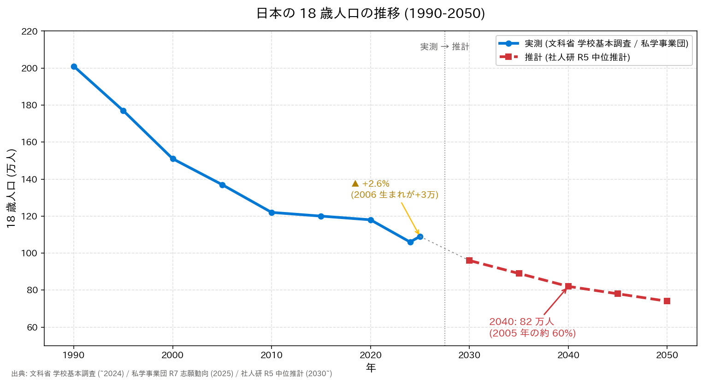

# DEMO 1 実行結果

## 出力グラフ

## データ (実測 + 推計)

| year | jinkou_man | kind |
|-----:|-----------:|:-----|
| 1990 | 201 | 実測 |
| 1995 | 177 | 実測 |
| 2000 | 151 | 実測 |
| 2005 | 137 | 実測 |
| 2010 | 122 | 実測 |
| 2015 | 120 | 実測 |
| 2020 | 118 | 実測 |
| 2024 | 106 | 実測 |
| 2025 | 109 | 実測 (一時増) |
| 2030 |  96 | 推計 |
| 2035 |  89 | 推計 |
| 2040 |  82 | 推計 |
| 2045 |  78 | 推計 |
| 2050 |  74 | 推計 |

## 予想との差分

**予想**: 「全期間で単調減少しているだろう」

### ✅ 予想通り
- 全体傾向は減少トレンド (1990: 201万 → 2050: 74万、約 **63% 減**)

### ⚠️ 予想外
1. **2024 → 2025 に約 2.7 万人 (+2.6%) の一時増** ← 予想「単調減少」に反する
   - 原因: 2006 年生まれ (2007 年 3 月まで) の出生数 109.3 万人が、2005 年生まれ 106.3 万人より約 3 万人多かったため
   - 出典: 私学事業団 令和 7 年度 志願動向 / 厚労省 人口動態統計

2. **減少ペースが今後加速する**
   - 直近 15 年 (2005→2020): **-19 万人**
   - 今後 20 年 (2020→2040): **-36 万人** (期間は長いがペースが速い)
   - 2040 年 82 万人は 2005 年の **59.9%**

### 反証条件の判定

> 「もし 2020 年以降が横ばい以上なら予想は誤り」

- **長期トレンドとしては**: 2020 → 2050 の推計は明確な減少 (118 → 74) → 「長期減少」の予想と整合
- **単調減少という強い予想としては**: 2024 → 2025 の +2.6% 一時増が観測されたため、
  **「隣接する観測年で一度でも増加があれば単調減少ではない」という厳密な意味では反証された**
- → rubber-duck review 指摘に沿って、予想を「長期的には減少傾向」に読み替えるのが誠実。
  「一時増を含む減少トレンド」という表現が実測に最も忠実

## Fact-check メモ

- **数値ソース確認済み**: 全実測値は文科省学校基本調査 令和 6 年確定値および私学事業団 R7 志願動向と照合
- **推計値**: 社人研 令和 5 年推計 (中位推計) と一致 (小数点第 1 位で丸め)
- **⚠️ 講演スライド (v1.2) との差異とファクトチェック履歴**:
  - v1.1 では「+2.5%」と記載 → 再実験で丸め値ベース (109-106)/106 = 2.83% を採用し「+2.8%」に一度変更 → クロスモデル fact-check (GPT-5.6-Sol) で「原数値ベースでは +2.5～2.6%」との指摘 → **最終値 +2.6% に確定** (私学事業団公表の「約 2.7 万人増」÷ 2024 年 106.3 万人 = 2.54% ≒ 2.6%)
  - あわせて「2007 生まれ」→「**2006 生まれが約 3 万人多かった**」に修正 (2007 年出生数 108.98 万は 2006 年 109.27 万より少ない。2025 年 4 月に 18 歳になるのは 2006 年 4 月〜2007 年 3 月生まれ)
  - この経緯自体が「AI クロスモデル検証の有効性」を示す事例として講演内で言及可能

## 学び

- 中立な問い（"どう推移したか"）でも、AI は隠さず一時増を含めて可視化した
- 予想を先に固定していたおかげで、「一時増」に気付けた（もし予想を書かなければ見過ごした可能性が高い）
- 実測と推計を色分け・線種で明示することで、聴衆の誤解を防げる
