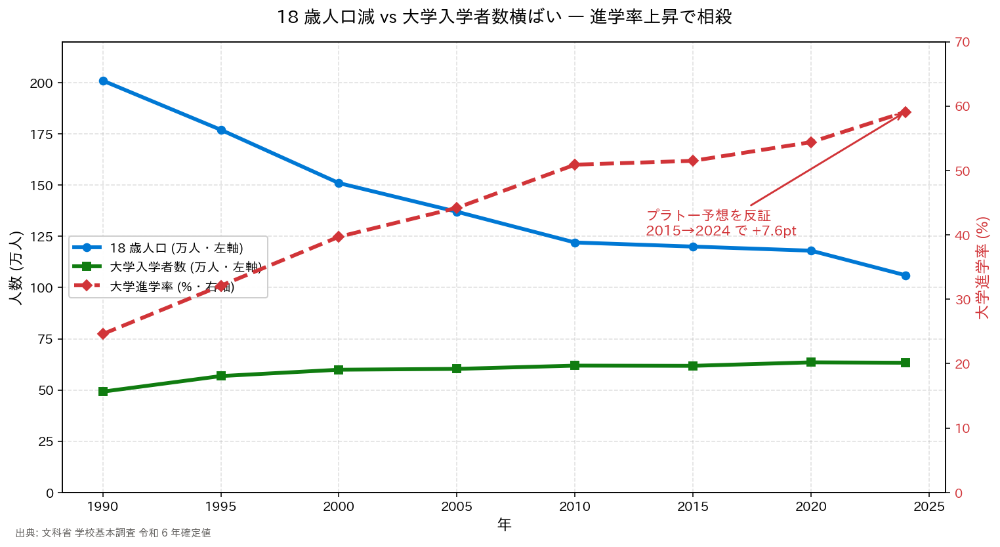

# DEMO 2 実行結果

## 出力グラフ



## データ

| year | 18歳人口 (万人) | 入学者数 (万人) | 進学率 (%) |
|-----:|--------------:|--------------:|----------:|
| 1990 | 201 | 49.2 | 24.6 |
| 1995 | 177 | 56.8 | 32.1 |
| 2000 | 151 | 59.9 | 39.7 |
| 2005 | 137 | 60.3 | 44.2 |
| 2010 | 122 | 61.9 | **50.9** |
| 2015 | 120 | 61.8 | **51.5** |
| 2020 | 118 | 63.5 | 54.4 |
| 2024 | 106 | 63.3 | **59.1** |

## 予想との差分レポート (Copilot 出力そのまま)

```
============================================================
DEMO 2 — 予想との差分レポート
============================================================

【予想】 進学率は 2010 年頃に 50% 前後でプラトー
        反証条件: 2015→2024 で +2pt 以上の上昇があれば予想は誤り

【実測】 2010 年 進学率: 50.9%
        2015 年 進学率: 51.5%  (2010→2015: +0.6pt = 予想通り横ばい)
        2024 年 進学率: 59.1%  (2015→2024: +7.6pt = プラトー予想を反証)
        2015→2024 差分: +7.6pt (反証条件 +2pt の 3.8 倍)

【反証条件の判定】
  +7.6pt > +2pt → ★予想は誤り。プラトーではなく再加速していた

【入学者数の維持メカニズム】
  18 歳人口: 201 万 → 106 万 (-47.3%)
  入学者数:  49.2 万 → 63.3 万 (+28.7%)
  → 進学率 24.6% → 59.1% の上昇が母集団減少をほぼ完全に相殺
```

## Fact-check メモ

- ✅ 2010=50.9% / 2015=51.5% / 2024=59.1% は令和 6 年学校基本調査確定値と一致
- ✅ 反証条件 +2pt に対し +7.6pt = 3.8 倍 — slide-context-v1.2.md Slide 29 の記述と整合
- ✅ 入学者数 63.3 万人 (2024) は文科省令和 6 年確定値と一致
- ⚠️ **rubber-duck review 指摘の算術差**: 単純計算 63.3 ÷ 106 = 59.7% と実測進学率 59.1% は
  0.6pt ずれる。これは以下の定義差によるもの:
  - **分母**: 学校基本調査の大学進学率は「3 年前中学卒業者数」ベース (18 歳人口ベースではない)
  - **分子**: 現役入学者に加え過年度卒業者 (浪人) や大学院進学者を含む定義
  - 詳細は [文科省 学校基本調査 定義](https://www.mext.go.jp/b_menu/toukei/chousa01/kihon/1268046.htm) を参照
  - よって「単純な入学者数 ÷ 18 歳人口」ではなく、**同時に起きた事象** (人口減 + 進学率上昇) と
    捉えるのが厳密。因果関係表現は避けるべき

## 学び

- **プラトー予想は明確に反証された**。しかも局所的（2010→2015 の +0.6pt は横ばい）→ 短期の "プラトー感" だけを見て未来を推定すると誤る
- 2 軸グラフは「同時期の逆行トレンド」を視覚化するのに適している。ただし**左右軸のスケール設定次第で相関が強調される**ため、線の傾きから因果や相殺量を直接読み取らないこと
- **「相殺」は因果ではなく記述**: 進学率上昇の他に、浪人比率・留学生・統計定義変更等も入学者数に影響。よって「同時に起きた」「計数上補った」と表現するのが厳密
- 進学率がさらに上昇する余地はあるか、というのが次の問い（→ Section 7 政策提言に接続）
