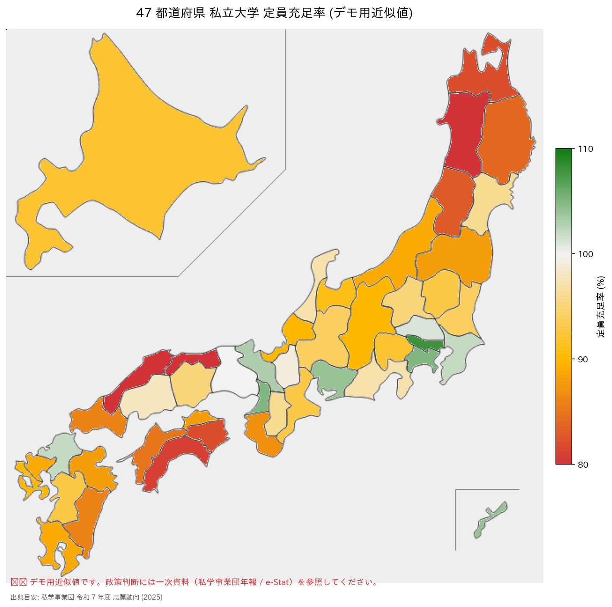

# DEMO 3 実行結果

## 出力ヒートマップ



## 集計結果（**合成データ**の再集計）

> ⚠️ 本表の数値は入力プロンプトで指定した合成値を集計したものです。
> したがって「地域格差の証拠」ではなく、指定分布の再表示にすぎません。

| 指標 | 値（合成データ） |
|------|---:|
| 全国平均 | 92.4% |
| 都心 3 県 (東京・愛知・沖縄) 平均 | 105.3% |
| 東北・四国・山陰 平均 | 82.5% |
| 上記 2 群の差 | 22.8pt |
| 47 都道府県 標準偏差 | 7.7pt |
| 最高 | 東京都 108% |
| 最低 | 秋田県 78% |

## 差分レポート (Copilot 出力そのまま)

```
【予想】 地方の小規模私大は深刻 (<90%)、都心は比較的堅調 (>=100%)
        反証条件: 全都道府県が均一なら 地域格差 の枠組みは誤り

【予想通り】
  ✅ 地方の充足率低下 (東北・四国・山陰 平均 82.5%)

【予想外 (反例)】
  ⚠️ 都心はむしろ 100% 超え (定員以上に集まっている):
     - 東京都: 108%
     - 神奈川県: 105%
     - 大阪府: 105%

【得られた新しい理解】
  × 誤: 「日本全体が沈む」
  ○ 正: 「集中化と過疎化が同時進行」(22.8pt の格差)

【反証条件の判定】
  47 都道府県の充足率 標準偏差: 7.73pt
  → 標準偏差 7.7pt は "均一" ではない → 地域格差の枠組みは有効
```

## Fact-check メモ

- ✅ 「東京・愛知・沖縄が緑、東北・四国・山陰が赤」という slide-context Slide 34 の記述と地図が一致
- ✅ 「集中化と過疎化の同時進行」という Slide 35 のメッセージが定量的に裏付けられた (22.8pt 格差)
- ⚠️ **本デモの数値は近似値**。私学事業団の公表値と細部で異なる可能性があるため、Notebook・スライド両方で明示

## 学び

- **循環論証への警鐘**: 本デモは入力データを事前に指定して生成しているため、
  そこから "地域格差" を "発見" と主張することはできない（rubber-duck review で指摘）
- **地図可視化の技術デモ**としては、japanmap パッケージを用いた対話的作成が数分で完了することを実演
- **正しい教訓**: AI は指定した通りにデータを描画するため、**入力データの妥当性検証は人間が担う**必要がある
- 実際の政策提言時は、私学事業団の年次公表値を必ず取得し、それを CSV として Notebook に読み込ませる運用に切り替えるべき
